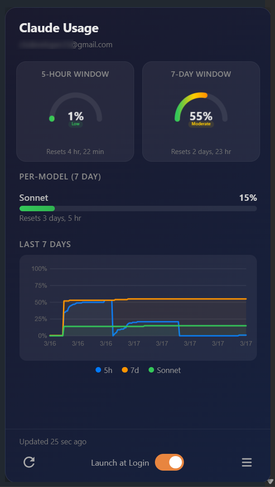

# Claude Usage

A lightweight Windows system tray application that tracks your Claude AI usage in real time.


---

<p align="center">
  
</p>

---

## Features

- **Real-time usage gauges** — 5-hour and 7-day usage windows displayed as visual gauge charts
- **Per-model breakdown** — See individual Opus and Sonnet utilization with color-coded progress bars
- **Extra usage tracking** — Monitor extra credit spending against your monthly limit
- **7-day trend chart** — Interactive line chart showing usage history over the past week
- **System tray app** — Runs quietly in the tray; click the icon to view, click away to hide
- **Auto-refresh** — Data refreshes every 5 minutes automatically
- **Dark/light theme** — Follows your Windows system theme automatically
- **Launch at login** — Optional auto-start with Windows

---

## Installation

### Download & Install (Recommended)

1. Download **`Claude Usage Setup 1.0.0.exe`** from the [Releases](../../releases) page
2. Run the installer — it will install and launch automatically
3. Look for the Claude icon in your **system tray** (bottom-right of your taskbar)

> No admin rights required. The app installs to your user profile.

### Build from Source

```bash
# Clone the repository
git clone https://github.com/your-username/claude-usage-app.git
cd claude-usage-app

# Install dependencies
npm install

# Run in development mode
npm start

# Build the installer
npm run build
```

The installer will be generated at `dist/Claude Usage Setup 1.0.0.exe`.

---

## Usage

1. **Click the tray icon** to open the usage panel
2. **Sign in** with your Claude account (opens browser for OAuth)
3. **Paste the code** from the browser back into the app
4. Your usage dashboard appears with live data

### Controls

| Control | Location | Description |
|---------|----------|-------------|
| Refresh | Bottom-left icon | Manually refresh usage data |
| Launch at Login | Bottom-center toggle | Auto-start app with Windows |
| Menu (hamburger) | Bottom-right icon | Sign Out / Quit options |

### Tray Icon

- **Left-click** — Toggle the usage panel
- **Right-click** — Context menu (Show / Quit)

---

## How It Works

The app authenticates with your Claude account using OAuth 2.0 (PKCE flow) and queries the Anthropic API for your current usage data. All credentials and history are stored locally on your machine.

### Data Displayed

| Metric | Description |
|--------|-------------|
| **5-Hour Window** | Your usage within the current 5-hour rolling window |
| **7-Day Window** | Your usage within the current 7-day rolling window |
| **Opus / Sonnet** | Per-model usage breakdown (if available) |
| **Extra Usage** | Additional credit consumption beyond your plan (if enabled) |
| **7-Day Chart** | Historical usage trend with all metrics plotted |

### Color Coding

| Usage Level | Color |
|-------------|-------|
| 0–49% | Green |
| 50–69% | Yellow |
| 70–84% | Orange |
| 85–94% | Red |
| 95–100% | Red (pulsing) |

---

## Project Structure

```
claude-usage-app/
├── main.js          # Electron main process (tray, OAuth, API calls)
├── preload.js       # Secure IPC bridge between main and renderer
├── renderer.js      # Dashboard UI logic and event handling
├── index.html       # Application markup
├── styles.css       # Styling with dark/light theme support
├── gauge.js         # Custom gauge chart component
├── chart.js         # Custom line chart component
├── icon.ico         # Application icon
└── package.json     # Dependencies and build configuration
```

### Technical Details

- **Framework:** Electron 41
- **Auth:** OAuth 2.0 with PKCE (no client secret stored)
- **API:** Anthropic Usage API (`api.anthropic.com`)
- **Storage:** Local JSON files in `%APPDATA%/claude-usage-app/claude-usage/`
  - `credentials.json` — OAuth tokens (auto-refreshed)
  - `history.json` — Usage data points (last 30 days)
- **Security:** Context isolation enabled, no `nodeIntegration`
- **Build:** electron-builder with NSIS installer

---

## Troubleshooting

| Problem | Solution |
|---------|----------|
| App doesn't appear | Check the system tray (click the **^** arrow in the taskbar to see hidden icons) |
| Sign-in fails | Make sure you paste the full code from the browser, including any characters after `#` |
| Data not updating | Click the refresh button; check your internet connection |
| Token expired | The app auto-refreshes tokens. If it fails, sign out and sign back in |
| Tray icon missing after restart | Enable "Launch at Login" in the app's footer |

---

## Contributing

1. Fork the repository
2. Create your feature branch (`git checkout -b feature/my-feature`)
3. Commit your changes (`git commit -m 'Add my feature'`)
4. Push to the branch (`git push origin feature/my-feature`)
5. Open a Pull Request

---

## License

MIT
