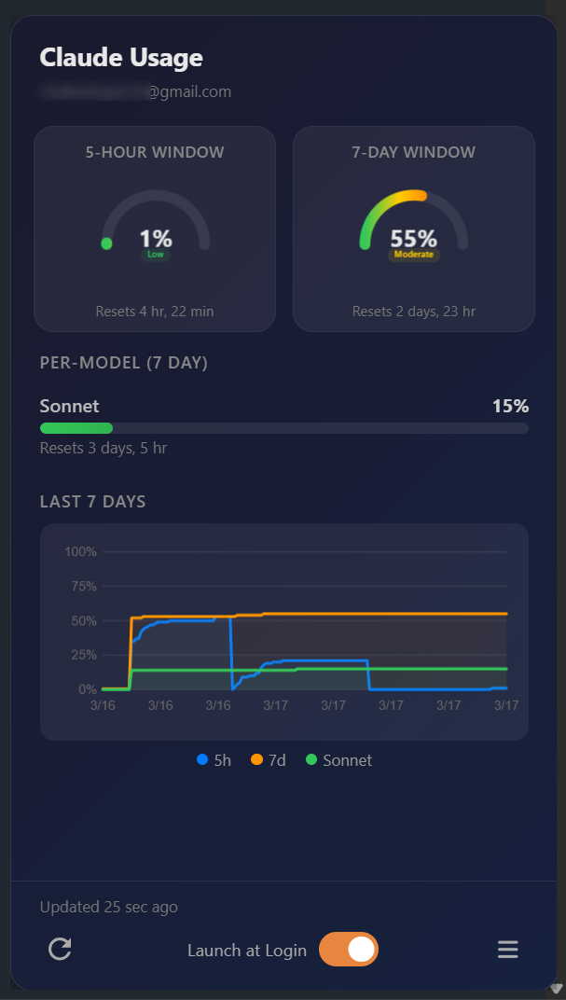

# Claude Usage

A lightweight Windows system tray application that tracks your AI usage across multiple providers in real time.


---

<p align="center">
  
</p>

---

## Features

### Claude (OAuth)
- **Real-time usage gauges** — 5-hour and 7-day usage windows displayed as visual gauge charts
- **Per-model breakdown** — See individual Opus and Sonnet utilization with color-coded progress bars
- **Extra usage tracking** — Monitor extra credit spending against your monthly limit
- **7-day trend chart** — Interactive line chart showing usage history over the past week

### Multi-Provider (Local Scan)
- **Codex** — Scans OpenAI Codex CLI session logs from `~/.codex/`
- **Gemini** — Scans Google Gemini CLI chat sessions from `~/.gemini/tmp/`
- **Cursor** — Scans Cursor AI session data from `~/.cursor/`
- Per-provider token charts, session counts, turn counts, and cost estimates

### Detailed Stats Tab
- Full session history with project, model, duration, turns, and cost
- Filterable by provider, model, and time range (7 / 30 / 90 days / all)
- Daily token usage chart (input vs output)
- Model distribution pie chart
- Top projects bar chart
- Cost-by-model breakdown table

### App
- **System tray app** — Runs quietly in the tray; click the icon to view, click away to hide
- **Auto-refresh** — Data refreshes every 5 minutes automatically
- **Dark/light theme** — Follows your Windows system theme automatically
- **Launch at login** — Optional auto-start with Windows
- **Secure credentials** — OAuth tokens encrypted via Windows DPAPI (safeStorage)

---

## Installation

### Download & Install (Recommended)

1. Download **`Claude Usage Setup 1.1.0.exe`** from the [Releases](../../releases) page
2. Run the installer — it will install and launch automatically
3. Look for the Claude icon in your **system tray** (bottom-right of your taskbar)

> No admin rights required. The app installs to your user profile.

### Build from Source

```bash
# Clone the repository
git clone https://github.com/your-username/claude-usage-app.git
cd claude-usage-app

# Install dependencies
npm install

# Rebuild native modules for Electron
npx electron-rebuild

# Run in development mode
npm start

# Build the installer
npm run build
```

The installer will be generated at `dist/Claude Usage Setup 1.1.0.exe`.

---

## Usage

1. **Click the tray icon** to open the usage panel
2. **Sign in** with your Claude account (opens browser for OAuth)
3. **Paste the code** from the browser back into the app
4. Your usage dashboard appears with live data

Other providers (Codex, Gemini, Cursor) are detected automatically from local log files — no sign-in required.

### Controls

| Control | Location | Description |
|---------|----------|-------------|
| Refresh | Bottom-left icon | Manually refresh usage data |
| Launch at Login | Bottom-center toggle | Auto-start app with Windows |
| Provider Settings (⚙️) | Bottom-right icon | Enable/disable providers, enter API keys |
| Menu (hamburger) | Bottom-right icon | Sign Out / Quit options |

### Tabs

| Tab | Description |
|-----|-------------|
| **Özet** | Summary view — gauges, provider switcher, 7-day chart |
| **Detaylı** | Detailed stats — session table, charts, model cost breakdown |

### Tray Icon

- **Left-click** — Toggle the usage panel
- **Right-click** — Context menu (Show / Quit)

---

## How It Works

### Claude
Authenticates with your Claude account using OAuth 2.0 (PKCE flow) and queries the Anthropic API for your current usage data. Tokens are encrypted at rest using Windows DPAPI via Electron's `safeStorage`.

### Local Providers (Codex, Gemini, Cursor)
Scans local session log files written by each CLI tool. No network requests — all data stays on your machine. A SQLite database (`usage.db`) stores parsed session data for fast querying.

### Data Displayed

| Metric | Description |
|--------|-------------|
| **5-Hour Window** | Your Claude usage within the current 5-hour rolling window |
| **7-Day Window** | Your Claude usage within the current 7-day rolling window |
| **Opus / Sonnet** | Per-model usage breakdown (if available) |
| **Extra Usage** | Additional credit consumption beyond your plan (if enabled) |
| **7-Day Chart** | Historical usage trend with all metrics plotted |
| **Sessions** | Number of AI coding sessions per provider |
| **Turns** | Number of request/response pairs |
| **Cost** | Estimated cost based on published token prices |

### Color Coding

| Usage Level | Color |
|-------------|-------|
| 0–49% | Green |
| 50–69% | Yellow |
| 70–84% | Orange |
| 85–94% | Red |
| 95–100% | Red (pulsing) |

---

## Project Structure

```
claude-usage-app/
├── main.js              # Electron main process (tray, OAuth, IPC)
├── preload.js           # Secure IPC bridge between main and renderer
├── renderer.js          # Dashboard UI logic and event handling
├── detailedStats.js     # Detailed stats tab rendering
├── scanner.js           # SQLite database helpers and query functions
├── index.html           # Application markup
├── styles.css           # Styling with dark/light theme support
├── gauge.js             # Custom gauge chart component
├── chart.js             # Custom line chart component
├── icon.ico             # Application icon
├── package.json         # Dependencies and build configuration
└── providers/
    ├── registry.js      # Provider registry singleton
    ├── base.js          # BaseProvider abstract class
    ├── claude/          # Claude OAuth provider + scanner
    ├── codex/           # OpenAI Codex CLI scanner
    ├── gemini/          # Google Gemini CLI scanner
    └── cursor/          # Cursor AI scanner
```

### Technical Details

- **Framework:** Electron 41
- **Auth:** OAuth 2.0 with PKCE (no client secret stored)
- **Credential Security:** OS-level encryption via `safeStorage` (Windows DPAPI / macOS Keychain)
- **API:** Anthropic Usage API (`api.anthropic.com`)
- **Local Storage:** SQLite (`better-sqlite3`) for session data; JSON for history
  - `usage.db` — Parsed session data from all providers
  - `credentials.json` — Encrypted OAuth tokens (auto-refreshed)
  - `history.json` — Usage data points (last 30 days)
- **Security:** Context isolation, no `nodeIntegration`, Content Security Policy, `openExternal` allowlist
- **Build:** electron-builder with NSIS installer, `asarUnpack` for native SQLite module

---

## Troubleshooting

| Problem | Solution |
|---------|----------|
| App doesn't appear | Check the system tray (click the **^** arrow in the taskbar to see hidden icons) |
| Sign-in fails | Make sure you paste the full code from the browser, including any characters after `#` |
| Data not updating | Click the refresh button; check your internet connection |
| Token expired | The app auto-refreshes tokens. If it fails, sign out and sign back in |
| Tray icon missing after restart | Enable "Launch at Login" in the app's footer |
| Gemini/Codex shows no data | Ensure you have used the respective CLI tool and sessions exist in `~/.gemini/` or `~/.codex/` |

---

## Contributing

1. Fork the repository
2. Create your feature branch (`git checkout -b feature/my-feature`)
3. Commit your changes (`git commit -m 'Add my feature'`)
4. Push to the branch (`git push origin feature/my-feature`)
5. Open a Pull Request

---

## License

MIT
